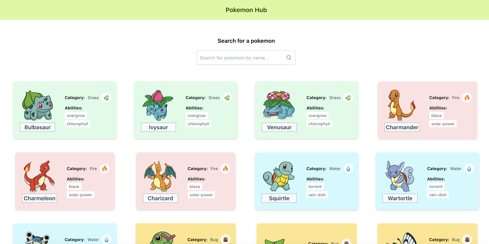

# Apps using useState hook

## Initializing & starting the app

- Initialize your app by navigating to starter directory
- Execute the commands below to start the app in starter directory (always start from the root directory use-effect-react)

```
cd starter
npm i
npm run dev
```

- Execute the commands below to start the app in final directory (always start from the root directory use-effect-react)

```
cd final
npm i
npm run dev
```

### Objectives:

- Using useEffect react hook
- Adding functionalities to Pokemon Hub App
  - use the pokeapi [pokeapi list](https://pokeapi.co/api/v2/pokemon?limit=45&offset=0)
  - search pokemon by name
  - use the pokeapi [pokeapi get by id](https://pokeapi.co/api/v2/pokemon/1/)
  - color the cards based on the type/category of pokemon
  - add the emoji based on the type/category of pokemon
  - display the name, abilities
- Use starter directory to add the functionalities, refer to final directory for a working a solution

#### Outputs

1. Pokemon hub app

   
